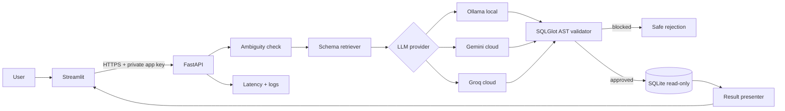

# QueryGuard AI

**Governed Text-to-SQL Analytics Copilot**

QueryGuard AI turns natural-language analytics questions into SQLite queries, but it does **not** let an LLM execute arbitrary SQL. The application retrieves relevant schema context, generates SQL, parses and validates the query, enforces read-only execution, returns verified database rows, and records measurable latency and failure information.

> Portfolio status: implementation complete for the Chinook demo and prepared for cloud preview deployment. The same governed pipeline supports local Ollama, hosted Gemini, hosted Groq, and a deterministic CI/demo provider. Real provider accuracy is intentionally **not claimed** until that provider is run on the evaluation set.

## Why this is more than a chatbot

A basic text-to-SQL demo is usually `question -> LLM -> SQL`. QueryGuard adds engineering controls around generation:

1. schema extraction from the live database;
2. lexical or semantic schema retrieval;
3. explicit ambiguity checks;
4. configurable SQL generation through local Ollama, hosted Gemini, or hosted Groq;
5. SQLGlot AST validation;
6. approved-table enforcement;
7. SQLite read-only mode;
8. execution time and result-row limits;
9. one bounded repair attempt for ordinary model mistakes;
10. separate security rejection for dangerous SQL;
11. result-grounded explanation and chart selection;
12. reproducible evaluation and failure records.

## Demo architecture



## Main recruiter talking point

> I first built an explainable schema-retrieval baseline and a controlled local Text-to-SQL pipeline. The model never gets direct database privileges: SQL is parsed with SQLGlot, restricted to SELECT-style queries and approved tables, then executed through SQLite read-only mode with limits. I evaluate retrieval and result execution separately, request clarification for selected ambiguous questions, and allow only one repair attempt for normal generation failures.

## Tech stack

| Area | Technology | Purpose |
|---|---|---|
| Backend | Python, FastAPI, Pydantic | API and validation |
| Database | SQLite | zero-server local analytics demo |
| LLM providers | Ollama, Gemini, Groq | local/offline plus hosted deployment choices |
| Local default | `qwen2.5-coder:7b` | small configurable Ollama coding model |
| Hosted default | `gemini-3.5-flash` | cloud preview model configured through a secret key |
| Hosted alternative | `qwen/qwen3.6-27b` on Groq | open-model cloud alternative |
| SQL governance | SQLGlot | parser/AST validation |
| Baseline retrieval | custom BM25-style scorer | transparent benchmark baseline |
| Semantic retrieval | Sentence Transformers | optional embedding retrieval |
| UI | Streamlit | recruiter/demo interface |
| Testing | pytest | unit, integration, API, security tests |
| Deployment | Docker Compose, Render Blueprint, Streamlit Community Cloud | reproducible local run plus cloud preview |
| CI | GitHub Actions | lint/test automation |

## Repository layout

```text
queryguard-ai/
├── app/                         # Streamlit demo
├── artifacts/                   # generated embedding artifacts
├── configs/                     # readable configuration examples
├── data/
│   ├── chinook/                 # official Chinook 1.4.5 SQL + generated SQLite
│   └── evaluation/              # custom evaluation questions
├── docs/                        # architecture, deployment, interview notes
├── reports/                     # build/evaluation reports
├── results/                     # measured machine-readable outputs
├── scripts/                     # data setup and evaluation commands
├── src/queryguard/
│   ├── analysis/                # ambiguity + result presentation
│   ├── api/                     # FastAPI app
│   ├── database/                # schema extraction/read-only execution
│   ├── evaluation/              # metrics + runner
│   ├── governance/              # SQLGlot safety validation
│   ├── llm/                     # Ollama, Gemini, Groq, and demo clients
│   ├── retrieval/               # lexical and semantic schema retrieval
│   ├── schema/                  # schema documents
│   └── services/                # end-to-end workflow
└── tests/                       # unit/integration/API/security tests
```


## Cloud preview deployment

The repository includes `render.yaml` for the FastAPI backend and Streamlit Community Cloud support for the UI. The recommended public-demo configuration is:

- FastAPI on Render;
- `QUERYGUARD_LLM_PROVIDER=gemini`;
- `QUERYGUARD_GEMINI_MODEL=gemini-3.5-flash`;
- lexical retrieval to keep the free backend lightweight;
- a generated `QUERYGUARD_API_ACCESS_KEY` protecting `/query`;
- Streamlit Community Cloud sending that key server-side.

No real key belongs in Git. Create the provider key in its provider console and save it only in Render's secret settings. Then copy Render's generated QueryGuard access key into Streamlit Cloud secrets.

See [`docs/CLOUD_DEPLOYMENT.md`](docs/CLOUD_DEPLOYMENT.md) for exact deployment steps and provider alternatives.

## Quick start: offline smoke mode

The demo provider is deterministic and exists only so CI and a new clone can test the governed pipeline without downloading a multi-GB model.

```bash
python -m venv .venv
source .venv/bin/activate              # Windows: .venv\Scripts\activate
python -m pip install --upgrade pip
pip install -e ".[ui,dev]"

# The database is already bundled. This recreates it from the official source if needed.
python scripts/setup_chinook.py

export QUERYGUARD_LLM_PROVIDER=demo    # Windows PowerShell: $env:QUERYGUARD_LLM_PROVIDER="demo"
uvicorn queryguard.api.main:app --reload
```

In another terminal:

```bash
export QUERYGUARD_API_URL=http://localhost:8000
streamlit run app/streamlit_app.py
```

Open Streamlit at `http://localhost:8501`.

## Real local LLM mode with Ollama

Install Ollama from its official documentation, then pull a suitable local model:

```bash
ollama pull qwen2.5-coder:7b
ollama serve
```

Configure QueryGuard:

```bash
cp .env.example .env
# .env already defaults to:
# QUERYGUARD_LLM_PROVIDER=ollama
# QUERYGUARD_OLLAMA_MODEL=qwen2.5-coder:7b

uvicorn queryguard.api.main:app --reload
```

If your hardware cannot run the 7B model, set `QUERYGUARD_OLLAMA_MODEL` to a smaller compatible model and record that model name in evaluation results.

## API example

```bash
curl -X POST http://localhost:8000/query \
  -H "Content-Type: application/json" \
  -d '{"question":"Show the top 5 customers by revenue"}'
```

A successful response includes:

```json
{
  "status": "success",
  "sql": "...",
  "columns": ["CustomerId", "customer", "revenue"],
  "rows": [],
  "validation": {
    "is_safe": true,
    "tables": ["Customer", "Invoice"]
  },
  "retrieved_tables": [],
  "latency_ms": {}
}
```

The example structure above is illustrative. Actual rows and latency must come from a real run.

## Governance model

Generation instructions are **not** treated as a security boundary. Before execution the SQL validator checks that:

- exactly one statement was generated;
- the root is SELECT-style (`SELECT`, `UNION`, `INTERSECT`, `EXCEPT`);
- destructive/administrative AST nodes are absent;
- referenced physical tables are in the live schema allowlist;
- CTE aliases are not incorrectly treated as physical tables.

Approved SQL is then executed using SQLite URI `mode=ro` and `PRAGMA query_only=ON`. A progress handler enforces a time budget and `fetchmany(max_rows + 1)` limits returned rows.

Security-rejected SQL is **not repaired automatically**. Ordinary parse/schema/execution mistakes may receive at most one repair attempt.

## Retrieval strategies

### Lexical baseline

The baseline is a small BM25-inspired implementation in `retrieval/lexical.py`. It includes:

- token normalization;
- simple plural normalization;
- transparent analytics synonym expansion;
- direct table-name boost;
- inverse-document-frequency weighting.

### Semantic differentiator

Install:

```bash
pip install -e ".[semantic]"
export QUERYGUARD_RETRIEVAL_STRATEGY=semantic
```

The semantic retriever uses Sentence Transformers, normalized embeddings, NumPy dot products, and Top-K ranking. For Chinook-scale schemas a vector database is deliberately unnecessary.

## Data

### Chinook 1.4.5

The repository includes the official SQLite SQL creation/population script from `lerocha/chinook-database` v1.4.5 and a SQLite database generated from that script.

See [`data/README.md`](data/README.md) for provenance, checksums, licensing, and limitations.

### Spider 1.0

Spider is optional and not committed to this repository. To obtain the official benchmark linked by Yale:

```bash
pip install gdown
python scripts/download_spider.py
```

Spider should be used as a separate cross-domain benchmark, not as an excuse to tune on the final test set.

## Evaluation

The custom Chinook evaluation set contains 15 manually reviewed questions with executable gold SQL.

Run real LLM evaluation:

```bash
python -m queryguard.evaluation.runner \
  --provider ollama \
  --retrieval lexical \
  --output results/ollama_lexical.json
```

Run the deterministic smoke evaluator:

```bash
python -m queryguard.evaluation.runner --provider demo --max-examples 6
```

Run retrieval-only evaluation:

```bash
python scripts/evaluate_retrieval.py
```

### Results currently verified in this repository

| Metric | Status | Result | Scope |
|---|---|---:|---|
| Lexical table Recall@1 | **Measured** | **0.800** | 15 custom Chinook questions |
| Lexical table Recall@3 | **Measured** | **0.967** | 15 custom Chinook questions |
| Lexical table Recall@5 | **Measured** | **0.967** | 15 custom Chinook questions |
| Ollama execution match | **Not tested** | — | requires local model inference |
| Semantic retrieval | **Not tested** | — | requires optional model download |
| p95 LLM latency | **Not tested** | — | hardware/model dependent |

See `results/lexical_retrieval_baseline.json` for per-question records.

## Tests

```bash
pytest
```

Test categories:

- unit: ambiguity, retrieval, result matching, LLM-output cleanup;
- integration: live Chinook schema and read-only database execution;
- security: destructive SQL, multiple statements, table allowlist, CTE behavior;
- API: health and full demo-provider request.

The GitHub Action installs SQLGlot and runs the complete test suite on Python 3.11.

## Docker

Immediate offline smoke demo:

```bash
docker compose up --build
```

The Compose file defaults to the deterministic demo provider so it can boot without a model download. For real Ollama use:

```bash
QUERYGUARD_LLM_PROVIDER=ollama docker compose up --build
```

The API container connects to host Ollama through `host.docker.internal`.

## What this project intentionally does not do

- database writes;
- arbitrary database paths supplied by users;
- autonomous agents;
- arbitrary Python execution;
- production authentication/RBAC;
- row-level or column-level permissions;
- Kubernetes/Kafka/Redis;
- claims that valid SQL is always semantically correct.

Those omissions are deliberate scope decisions, not missing resume keywords.

## Known limitations

1. Ambiguity detection is rule-based and intentionally narrow.
2. SQL AST safety does not prove the business meaning of a query is correct.
3. Read-only SQL can still be computationally expensive; the timeout reduces but does not eliminate resource-exhaustion risk.
4. The custom Chinook set is small and not a user study.
5. Public benchmark contamination is possible for pretrained LLMs.
6. Semantic retrieval downloads an embedding model and was not required for the offline build verification.
7. Production deployment needs authentication, authorization, audit retention, richer rate limits, and database-specific controls.

## Documentation

- `docs/PROJECT_REPORT.md`
- `docs/ARCHITECTURE.md`
- `docs/TECHNOLOGY_DECISIONS.md`
- `docs/DEPLOYMENT.md`
- `docs/INTERVIEW_GUIDE.md`
- `docs/DSA_AND_CS_CONCEPTS.md`
- `docs/LEARNING_NOTES.md`
- `PROJECT_DECISIONS.md`
- `SECURITY.md`
- `reports/BUILD_VERIFICATION.md`

## Resume-ready line — only using implemented work

> Built QueryGuard AI, a Python/FastAPI Text-to-SQL analytics copilot with schema retrieval, SQLGlot AST governance, read-only SQLite execution, ambiguity handling, bounded query repair, evaluation tooling, automated tests, and Docker deployment.

Do not add an accuracy percentage to a resume until you run and save the corresponding model evaluation.

## License

Project code: MIT.

Bundled Chinook files retain their upstream MIT licensing and attribution. Spider is separately distributed by Yale under CC BY-SA 4.0 and is not bundled.
