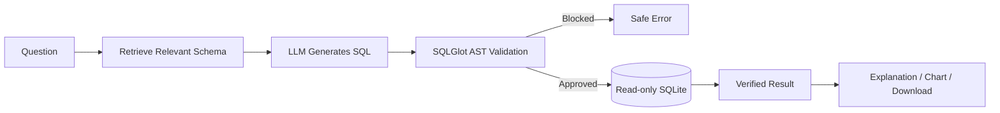
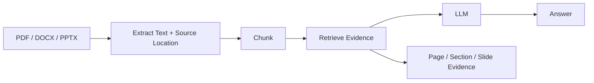

# QueryGuard AI

**Governed Data & Document Intelligence Platform**

QueryGuard AI is a portfolio project that combines **governed Text-to-SQL**, **evidence-grounded document question answering**, and **invoice analytics** in one understandable Python application.

It keeps the original Chinook Text-to-SQL demo, but also lets a user temporarily upload their own SQLite database, Excel/CSV data, PDF/DOCX/PPTX documents, or invoices.

> Portfolio scope: this is a personal/local analytics prototype, not an enterprise data-governance product. The public demo should use public or non-sensitive files only.

**Hosted demo:** https://queryguard-ai.streamlit.app/  
The hosted site follows the version deployed from the GitHub repository; after replacing `main` with this final V2 code, wait for Streamlit/Render to redeploy before treating the live site as the V2 build.

## What can it analyze?

| Mode | Input | Internal approach | Main output |
|---|---|---|---|
| Demo | Built-in Chinook SQLite | Governed Text-to-SQL | SQL + verified DB result |
| Database | `.db`, `.sqlite`, `.sqlite3` | Dynamic schema + Text-to-SQL | SQL + result + export |
| Spreadsheet | `.xlsx`, `.csv` | Convert to SQLite + Text-to-SQL | SQL + result + export |
| Documents | `.pdf`, `.docx`, `.pptx` | Parse → chunk → retrieve → grounded LLM answer | Answer + evidence |
| Invoices | PDF/image/XLSX/CSV | Extract fields → SQLite analytics + optional document retrieval | Invoice table + insights |

## Why this is not a simple chatbot

The LLM is not allowed to execute arbitrary SQL. A database question follows this pipeline:



Document questions use a different pipeline because unstructured documents should not be forced into SQL:



Invoice mode is hybrid: normalized invoice fields become SQLite for analytics, while invoice text remains available for evidence-oriented questions.

## Key capabilities

- Dynamic SQLite database upload and switching.
- Excel/CSV conversion into temporary SQLite tables.
- Schema extraction: tables, columns, primary keys, foreign keys.
- Explainable BM25-style schema retrieval baseline.
- Optional Sentence Transformer semantic retrieval.
- AST-based SQL governance with SQLGlot.
- Independent SQLite read-only execution boundary.
- Row limits and query timeout.
- One bounded SQL repair attempt.
- PDF/DOCX/PPTX parsing with page/section/slide provenance.
- Optional OCR for scanned PDFs/images through Tesseract.
- Evidence-grounded document Q&A.
- Conservative invoice field extraction with manual-review flags.
- CSV/XLSX/SQL/document-report downloads.
- Demo, Ollama, Gemini, and Groq provider modes.
- FastAPI backend + Streamlit recruiter UI.
- Docker, GitHub Actions, Render/Streamlit deployment files.
- Unit, integration, API, ingestion, retrieval, and security tests.

## Included synthetic demo files

The [`examples/`](examples/) folder contains small, non-sensitive files for trying the upload modes immediately:

- `sample_sales.csv` — spreadsheet analytics;
- `sample_policy.pdf` and `sample_handbook.docx` — cited document Q&A;
- `sample_briefing.pptx` — slide-aware document Q&A;
- `sample_invoices.csv` — normalized invoice analytics.

They are demo inputs only, not hidden evaluation data.

## LLM choices

QueryGuard supports one provider at a time:

| Provider | Intended use | API key? |
|---|---|---|
| `demo` | CI, smoke tests, Chinook example workflow | No |
| `ollama` | Local/offline inference | No cloud key |
| `gemini` | Recommended hosted demo | Yes |
| `groq` | Optional hosted alternative | Yes |

The provider is configured in `.env` or deployment environment variables. API keys are never supposed to be committed to Git.

## Quick local start

### 1. Clone and create a virtual environment

```powershell
git clone https://github.com/Vaibhav-153/queryguard-ai.git
cd queryguard-ai
python -m venv .venv
.\.venv\Scripts\Activate.ps1
python -m pip install --upgrade pip
pip install -e ".[ui,dev]"
```

macOS/Linux activation:

```bash
source .venv/bin/activate
```

### 2. Configure

Windows PowerShell:

```powershell
Copy-Item .env.example .env
```

macOS/Linux:

```bash
cp .env.example .env
```

The default `.env.example` uses:

```text
QUERYGUARD_LLM_PROVIDER=demo
```

### 3. Rebuild/verify Chinook

```bash
python scripts/setup_chinook.py
queryguard-verify
```

### 4. Run the API

```bash
uvicorn queryguard.api.main:app --reload
```

Open:

```text
http://127.0.0.1:8000/docs
```

### 5. Run the UI in another terminal

```bash
streamlit run app/streamlit_app.py
```

Open:

```text
http://localhost:8501
```

## Local AI with Ollama

Install Ollama separately, then pull a model:

```bash
ollama pull qwen2.5-coder:7b
```

Update `.env`:

```text
QUERYGUARD_LLM_PROVIDER=ollama
QUERYGUARD_OLLAMA_MODEL=qwen2.5-coder:7b
```

Restart FastAPI. QueryGuard now sends prompts to your local Ollama server instead of a hosted API.

See [`docs/LLM_GUIDE.md`](docs/LLM_GUIDE.md) for Gemini, Groq, model changes, privacy, and troubleshooting.

## Tests and verification

```bash
ruff check app src tests scripts
python -m compileall -q src app tests scripts
python scripts/setup_chinook.py
queryguard-verify
pytest -v
```

Independent evaluation commands:

```bash
python scripts/evaluate_retrieval.py
python scripts/evaluate_document_retrieval.py
python scripts/evaluate_invoice_extraction.py
```

### Verified measurements included in this repository

These are deliberately separated from untested LLM claims:

| Measurement | Status | Result |
|---|---|---|
| Chinook schema retrieval | Measured | Recall@1 `0.800`, Recall@3 `0.967`, Recall@5 `0.967` |
| Synthetic document lexical retrieval | Measured | Hit@1 `0.875`, Hit@3 `0.875` |
| Synthetic invoice text field extraction | Measured | Field exact match `1.000` on 3 simple hand-authored examples |
| Gemini Text-to-SQL execution accuracy | Not measured in artifact build | Run after adding a real key |
| Ollama Text-to-SQL execution accuracy | Not measured in artifact build | Run on target hardware |
| OCR accuracy | Not measured | Depends on scans/Tesseract |

The synthetic document/invoice sets are intentionally small. They verify implementation behavior; they are **not production benchmarks**.

### Final artifact verification snapshot

The packaged V2 build was checked in the available artifact runtime with **43 tests passing and 13 SQLGlot-dependent tests skipped** because SQLGlot was not available in that runtime. Python compilation, Chinook rebuild/verification, API health, sample-file ingestion, export tests, configuration parsing, and package-wheel build passed. Artifact-runtime coverage measured **68%**.

This is deliberately not presented as a fully green release gate: run the normal GitHub/Codespaces workflow after installing all dependencies and require the SQLGlot-dependent tests to run without dependency skips. See [`reports/BUILD_VERIFICATION.md`](reports/BUILD_VERIFICATION.md) for the exact tested/not-tested boundary.

## Repository map

```text
queryguard-ai/
├── app/                         # Streamlit UI + frontend API client
├── src/queryguard/
│   ├── api/                     # FastAPI routes
│   ├── database/                # SQLite schema + read-only execution
│   ├── governance/              # SQLGlot policy
│   ├── retrieval/               # Schema retrieval
│   ├── llm/                     # Ollama/Gemini/Groq/demo providers
│   ├── services/                # SQL and document orchestration
│   ├── workspaces/              # Temporary upload isolation
│   ├── ingestion/               # SQLite/Excel/CSV/PDF/DOCX/PPTX/OCR loaders
│   ├── documents/               # Chunking + document retrieval
│   ├── invoices/                # Invoice extraction + normalized DB
│   ├── export/                  # CSV/XLSX/DOCX report exporters
│   └── evaluation/              # Metrics + Text-to-SQL evaluator
├── tests/                       # Unit/integration/API/security tests
├── scripts/                     # Setup, evaluation, verification helpers
├── examples/                    # Small synthetic upload-demo files
├── data/                        # Demo/evaluation data only
├── docs/                        # Full theory + implementation guide
├── results/                     # Measured result artifacts
├── reports/                     # Build verification
├── Dockerfile
├── docker-compose.yml
├── render.yaml
└── .github/workflows/tests.yml
```

For a file-by-file walkthrough, read [`docs/CODEBASE_GUIDE.md`](docs/CODEBASE_GUIDE.md).

## Security model

Important controls:

- uploaded filenames are reduced to safe basenames;
- upload type/size allowlists;
- Office ZIP expansion limits;
- temporary random workspace IDs;
- uploaded SQLite integrity check;
- SQL AST validation;
- table allowlist derived from active schema;
- SQLite `mode=ro` and `PRAGMA query_only=ON`;
- result row limit;
- execution timeout;
- no arbitrary user filesystem paths;
- optional shared UI/API secret;
- secrets loaded from environment variables;
- user workspaces are Git-ignored and expire.

See [`docs/SECURITY.md`](docs/SECURITY.md) for threats and limitations.

## Dataset strategy

Chinook remains the reproducible default demo. User-uploaded data is temporary and does not modify the demo database.

If you want to permanently replace or add a dataset, follow [`docs/ADDING_DATASETS.md`](docs/ADDING_DATASETS.md). That guide explains SQLite, Excel/CSV, documents, evaluation-set creation, schema verification, and leakage prevention.

## Documentation index

- [`docs/PROJECT_REPORT.md`](docs/PROJECT_REPORT.md) — complete project narrative.
- [`docs/ARCHITECTURE.md`](docs/ARCHITECTURE.md) — components and data flows.
- [`docs/CODEBASE_GUIDE.md`](docs/CODEBASE_GUIDE.md) — how files call each other.
- [`docs/BUILD_FROM_SCRATCH.md`](docs/BUILD_FROM_SCRATCH.md) — chronological build/learning guide.
- [`docs/UI_GUIDE.md`](docs/UI_GUIDE.md) — what each screen and action does.
- [`docs/API_REFERENCE.md`](docs/API_REFERENCE.md) — API endpoints and contracts.
- [`docs/FEATURES.md`](docs/FEATURES.md) — problem → implementation → evaluation → trade-off.
- [`docs/THEORY_GUIDE.md`](docs/THEORY_GUIDE.md) — SQL, RAG, LLM, backend, security theory.
- [`docs/DATA_GUIDE.md`](docs/DATA_GUIDE.md) — data provenance and quality.
- [`docs/ADDING_DATASETS.md`](docs/ADDING_DATASETS.md) — changing/adding datasets.
- [`docs/DOCUMENT_PIPELINE.md`](docs/DOCUMENT_PIPELINE.md) — PDF/DOCX/PPTX RAG.
- [`docs/INVOICE_PIPELINE.md`](docs/INVOICE_PIPELINE.md) — invoice extraction and hybrid analytics.
- [`docs/LLM_GUIDE.md`](docs/LLM_GUIDE.md) — Demo/Ollama/Gemini/Groq.
- [`docs/LOCAL_SETUP.md`](docs/LOCAL_SETUP.md) — detailed local setup.
- [`docs/CLOUD_DEPLOYMENT.md`](docs/CLOUD_DEPLOYMENT.md) — Render + Streamlit Cloud.
- [`docs/TESTING.md`](docs/TESTING.md) — what each test protects.
- [`docs/EVALUATION.md`](docs/EVALUATION.md) — metrics and honest reporting.
- [`docs/SECURITY.md`](docs/SECURITY.md) — threat model.
- [`docs/TROUBLESHOOTING.md`](docs/TROUBLESHOOTING.md) — common failures.
- [`docs/INTERVIEW_GUIDE.md`](docs/INTERVIEW_GUIDE.md) — technical/design/debugging Q&A.
- [`docs/DSA_AND_CS_CONCEPTS.md`](docs/DSA_AND_CS_CONCEPTS.md) — natural CS concepts.
- [`docs/HIRING_PACKAGE.md`](docs/HIRING_PACKAGE.md) — resume/LinkedIn/demo material.
- [`docs/FINAL_REVIEW.md`](docs/FINAL_REVIEW.md) — final scored readiness review and acceptance gaps.

## Limitations

- Generated SQL can be syntactically safe but semantically wrong.
- Spreadsheet relationship inference is not automatic; uploaded sheets normally have no declared foreign keys.
- Document answers depend on retrieval and the selected LLM.
- Invoice PDF extraction is heuristic and deliberately flags uncertainty.
- OCR requires Tesseract and has not been benchmarked here.
- Temporary workspaces are designed for a personal/demo app, not durable multi-tenant storage.
- Public hosted demos should not receive confidential data.
- No enterprise authentication, row-level permissions, audit SIEM integration, or SLA is claimed.

## Production evolution

A real enterprise version could add authenticated user storage, PostgreSQL adapters, row/column permissions, durable object storage, encrypted workspace metadata, background ingestion, richer evaluation, monitoring, and human-review workflows. These are documented as future work rather than added only for resume keywords.

## License

QueryGuard AI code is MIT licensed. Third-party datasets such as Chinook and Spider retain their own licenses and attribution requirements. See `data/README.md`.
