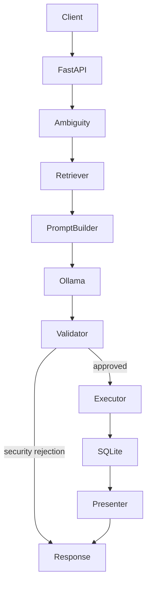
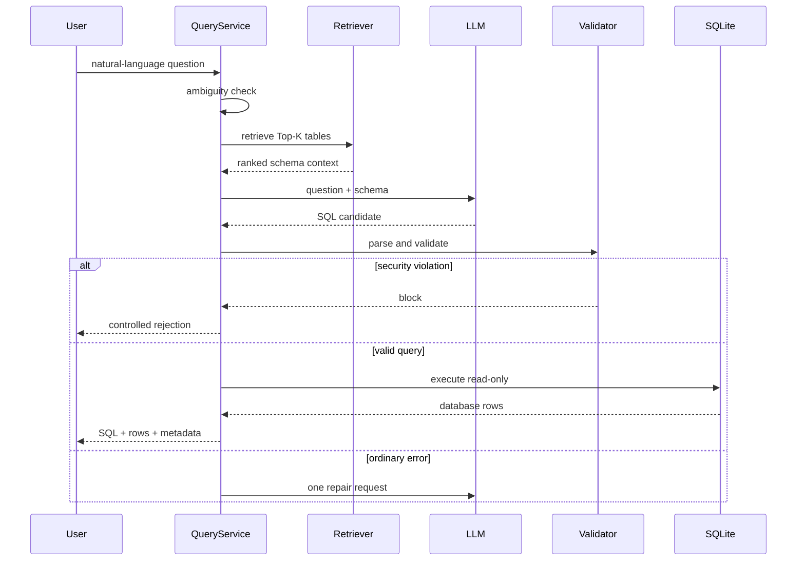

# Architecture

## System boundaries

QueryGuard is a modular monolith. This is intentional: one graduate developer can understand the complete request path without distributed-system overhead.

## Component responsibilities

- `database/schema.py`: discovers live tables, columns and foreign keys.
- `schema/documents.py`: turns schema objects into retrieval documents.
- `retrieval/lexical.py`: explainable ranking baseline.
- `retrieval/semantic.py`: embedding-based Top-K retrieval.
- `llm/ollama.py`: minimal HTTP client; no agent framework.
- `governance/validator.py`: SQLGlot AST policy enforcement.
- `database/connection.py`: independent read-only database safety boundary.
- `analysis/ambiguity.py`: narrow deterministic clarification rules.
- `services/query_service.py`: orchestration and one bounded repair attempt.
- `evaluation/runner.py`: end-to-end result execution comparison.

## Request sequence

## Storage

V1 uses a local SQLite file plus JSON/JSONL evaluation artifacts. It does not need PostgreSQL, Redis, object storage, or a vector database at Chinook scale.

## Failure handling

- incomplete/vague question -> clarification;
- LLM unavailable -> controlled `error` response;
- destructive/multi-statement SQL -> `blocked`, no repair;
- unknown table/parse/execution error -> at most one repair;
- timeout -> controlled database error;
- empty valid result -> successful response with zero rows.

## Production evolution

A real internal deployment would add an authenticated identity, per-user dataset permissions, row/column policies, audit retention, connection pooling, workload limits, database-specific statement timeouts, model/prompt version tracking, and monitored evaluation sets before adding distributed infrastructure.
