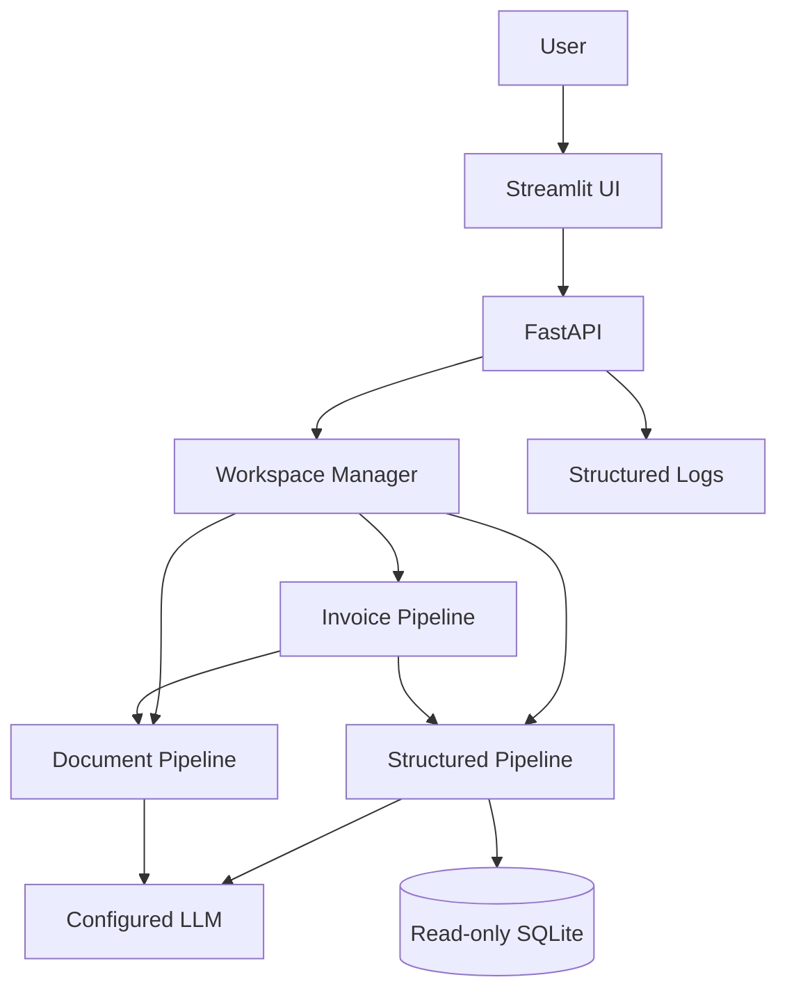
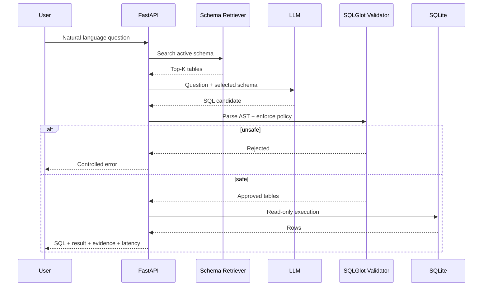
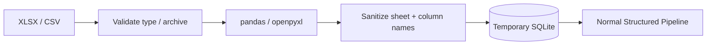
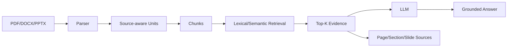
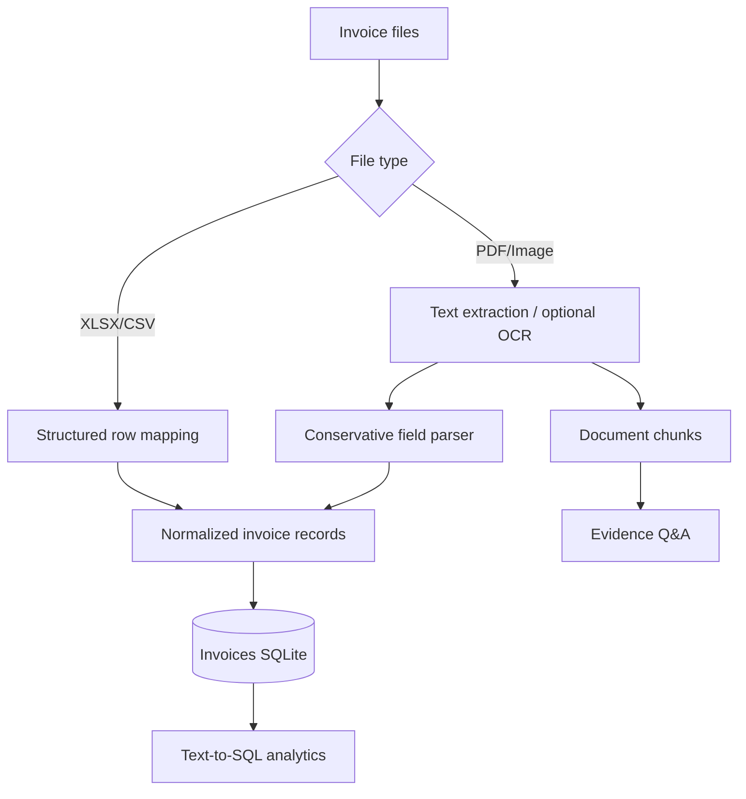
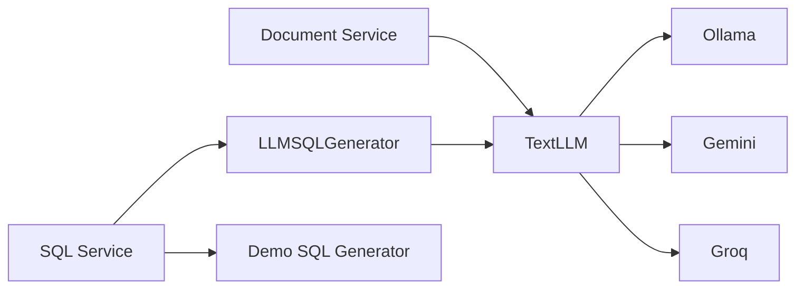

# Architecture

## Design goal

QueryGuard has one frontend and one backend, but it uses **different deterministic pipelines for different source types**. This avoids the weak design of sending every uploaded file directly to an LLM.

## System overview



## Structured pipeline

Used by the Chinook demo, uploaded SQLite, Excel, CSV, and normalized invoices.



## Spreadsheet ingestion



Excel is converted rather than creating a second analytics engine. This keeps SQL governance and evaluation reusable.

## Document pipeline



Document text is explicitly treated as **untrusted data** in the system prompt. Instructions embedded inside a PDF should not override the application instruction.

## Invoice pipeline



This is intentionally hybrid: numerical aggregation is better handled by SQL, while wording such as payment terms is better handled through document evidence.

## Workspace architecture

Uploaded files never replace `data/chinook/Chinook_Sqlite.sqlite`.

```text
data/workspaces/<random-id>/
├── metadata.json
├── uploads/
├── workspace.sqlite          # spreadsheets when applicable
├── invoices.sqlite           # invoice mode when applicable
├── document_chunks.json      # document evidence when applicable
└── invoice_records.json      # normalized invoice fields
```

`WorkspaceManager` creates random UUID-based directories, applies upload limits, persists metadata, expires old workspaces, and never accepts an arbitrary user path.

## LLM provider architecture



The provider interface is intentionally small: `complete(prompt, system_prompt, max_tokens)`. Provider-specific HTTP details stay inside `llm/`.

## Deployment

### Local

```text
Browser → Streamlit :8501 → FastAPI :8000 → Ollama :11434 / hosted provider
```

### Hosted portfolio demo

```text
Browser
  ↓
Streamlit Community Cloud
  ↓ HTTPS + shared QueryGuard key
Render FastAPI
  ↓
Gemini API
```

Uploaded workspaces on a free hosted service are temporary. The local/Docker path is the reproducible primary path for private files.

## Failure handling

- invalid upload → HTTP 400 with reason;
- oversized upload → HTTP 413;
- expired workspace → HTTP 404 and re-upload instruction;
- missing provider key → HTTP 503 rather than a fake answer;
- unsafe SQL → `blocked` response;
- ordinary invalid SQL → one repair attempt, then error;
- query timeout → controlled database error;
- no document evidence → explicit unsupported answer;
- OCR unavailable → clear dependency message;
- invoice uncertainty → `needs_review=true` instead of guessing silently.
