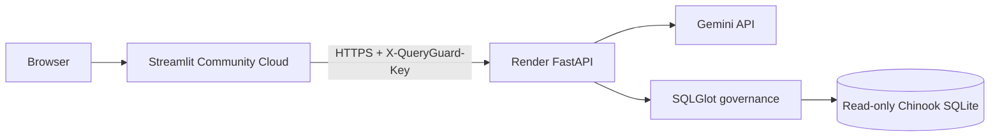

# Cloud preview deployment

This deployment is designed for a recruiter-facing portfolio preview, not an enterprise production system.

## Recommended topology



The same FastAPI backend can switch to Groq or local Ollama without changing the governance or database code.

## Secret values you need

### Required for the default cloud deployment

1. `QUERYGUARD_GEMINI_API_KEY`
   - Create it in Google AI Studio.
   - Never commit it to GitHub.
   - Save it only in Render's environment/secret settings.

2. `QUERYGUARD_API_ACCESS_KEY`
   - `render.yaml` asks Render to generate this random value automatically.
   - Copy the generated value from Render into Streamlit Community Cloud secrets.
   - This key is only an app-to-app shared secret; it is not the Gemini key.

### Optional alternative

`QUERYGUARD_GROQ_API_KEY`

Use this only if you switch `QUERYGUARD_LLM_PROVIDER` to `groq`.

## Step 1 - push this repository to GitHub

Do not commit `.env` or `.streamlit/secrets.toml`.

Confirm only the example files are tracked:

```bash
git status
git add .
git commit -m "feat: add secure cloud deployment providers"
git push
```

## Step 2 - deploy FastAPI on Render

The repository root contains `render.yaml`.

1. Sign in to Render.
2. Create a new Blueprint from the GitHub repository.
3. Render reads `render.yaml`.
4. When prompted for `QUERYGUARD_GEMINI_API_KEY`, paste the key created in Google AI Studio.
5. Deploy the Blueprint.
6. Wait for `/health` to return HTTP 200.

Expected public URL shape:

```text
https://queryguard-api.onrender.com
```

Health endpoint:

```text
https://queryguard-api.onrender.com/health
```

The health response intentionally shows provider/model names but never secret values.

## Step 3 - copy the generated QueryGuard access key

In Render, open the service environment variables and reveal/copy the generated value for:

```text
QUERYGUARD_API_ACCESS_KEY
```

Do not put this value in GitHub.

## Step 4 - deploy Streamlit

1. Sign in to Streamlit Community Cloud.
2. Create an app from the same GitHub repository.
3. Main file path:

```text
app/streamlit_app.py
```

4. In App settings -> Secrets, add:

```toml
QUERYGUARD_API_URL = "https://YOUR-RENDER-SERVICE.onrender.com"
QUERYGUARD_API_ACCESS_KEY = "PASTE_THE_RENDER_GENERATED_VALUE"
```

5. Deploy the app.

The Streamlit server sends the private access key to FastAPI. It is not rendered into the browser page.

## Step 5 - smoke test the hosted application

Try these questions:

```text
How many customers are in the database?
Show the top 5 customers by revenue
Which countries generated the most revenue?
Which genres have the most tracks?
What is the average track price?
```

Check that the UI shows:

- backend connected;
- hosted provider and model;
- generated SQL;
- governance status;
- approved tables;
- verified SQLite results;
- schema retrieval evidence;
- latency breakdown.

## Switch the hosted backend to Groq

In Render environment variables set:

```text
QUERYGUARD_LLM_PROVIDER=groq
QUERYGUARD_GROQ_API_KEY=<your Groq key>
QUERYGUARD_GROQ_MODEL=qwen/qwen3.6-27b
```

Redeploy. No frontend change is required.

## Use Gemini Flash-Lite instead

For a lighter/high-throughput option:

```text
QUERYGUARD_LLM_PROVIDER=gemini
QUERYGUARD_GEMINI_MODEL=gemini-3.5-flash-lite
```

## Ollama remains supported

Local/offline mode:

```bash
export QUERYGUARD_LLM_PROVIDER=ollama
export QUERYGUARD_OLLAMA_MODEL=qwen2.5-coder:7b
uvicorn queryguard.api.main:app --reload
```

A stronger but much larger local alternative is `qwen3-coder:30b` if the machine has sufficient memory. The provider interface does not need code changes; only the model environment variable changes.

## Why lexical retrieval is the cloud default

The bundled schema is small and the measured lexical baseline already has strong Recall@K. Keeping lexical retrieval on a small free Render service avoids loading a Sentence Transformer and PyTorch simply for a small demo schema.

Semantic retrieval remains available locally or on larger infrastructure with:

```text
QUERYGUARD_RETRIEVAL_STRATEGY=semantic
```

and the `semantic` optional dependency.

## Privacy note

The demo database is public synthetic/sample data. Do not connect this public deployment to private business databases. Hosted-model free tiers can have different data-use terms from paid enterprise tiers; review the provider terms before sending confidential information.

## Failure recovery

### Render returns 503 provider configuration error

Check that the selected provider's key exists in Render.

### Streamlit shows a key mismatch

Make sure the exact Render `QUERYGUARD_API_ACCESS_KEY` value is also present in Streamlit secrets.

### Render is slow on the first request

Free services can cold-start after inactivity. Retry after the backend health endpoint becomes available.

### Gemini quota/rate limit reached

Switch to the optional Groq provider, reduce public usage, or wait for quota reset. Do not remove API protection just to avoid quota errors.
